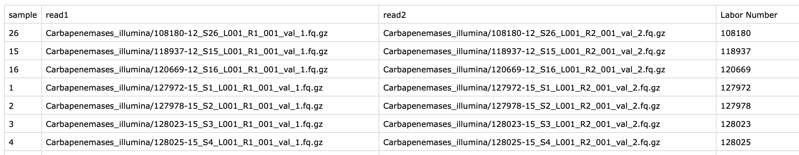
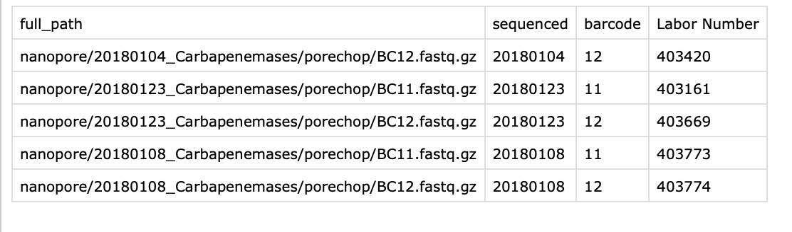
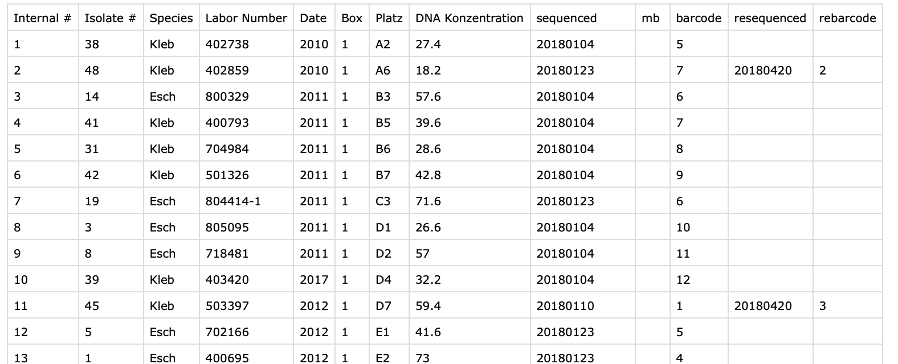

# Solution for the assignment

## Content

[Repository Structure](#repository-structure)

[Prepare virtual env](#prepare-virtual-env)

[Task 1. Parse data files](#task-1.-parse-data-files)

[Task 2. List files by species](#task-2.-list-files-by-species)

[Task 3. Query UniProtKB](#task-3.-query-UniProtKB)

[Task 4. Comment on following aspects](#task-4.-comment-on-following-aspects)


## Repository Structure

The link to forked repository: https://github.com/kate-v-stepanova/data-engineer-assignment

The directory [solution](solution/)  was added to the original repo and contains all the files related to the solution:

* Script [1_parse_files.py](1_parse_files.py) for the first task

* Script  [2_list_files_by_species.py](2_list_files_by_species.py)  for the second task

* Script [3_query_protKB.py](3_query_protKB.py)  for the third task

* DB file [assignment_db.sql](assignment_db.sql) containing the following tables:

  * `nanopore`
  * `illumina`
  * `sample_table`
  * `mic`
  * `UniProtKB` 

* File [joined_tables.csv](joined_tables.csv) which contains the output of the task 2

* File [SOLUTION.md](SOLUTION.md) that lists all the commands executed for the assignment, as well as answers to the questions which don't require implementation

  

## Prepare virtual env

### 1. Clone github repo

```
git clone git@github.com:kate-v-stepanova/data-engineer-assignment.git
cd data-engineer-assignment
```

### 2. Create conda environment

```
conda create -n assignment python=3.8
source activate assignment
pip install -r pip_requirements.txt
```

Requirements are the following:

```
pandas
sqlite3
click
requests
```


## Task 1. Parse data files

**Task 1:** Write a script (e.g. in Python) to parse the four provided files and create an SQL database (e.g. local SQLite DB) to store the key information from the dataset.

### 0. Print script help

Get help:

```
python solution/1_parse_files.py --help
```

Will give the following output:

```
Usage: 1_parse_files.py [OPTIONS] INFILE DBFILE [TABLE_NAME] COMMAND [ARGS]...

Options:
  --replace-if-exists  replace table if exists, otherwise do nothing
  --help               Show this message and exit.

Commands:
  illumina      parse illumina data
  mic           parse mic data
  nanopore      parse nanopore data
  sample-table  parse sample_table
```


### 1. Parse `Illumina` file

```
python solution/1_parse_files.py illumina_data.tree solution/assignment_db.sql illumina illumina
```

### 2. Parse `nanopore` file

```
python solution/1_parse_files.py nanopore_data.tree solution/assignment_db.sql nanopore nanopore
```

### 3. Parse `sample_table`

```
python solution/1_parse_files.py sample_table.csv solution/assignment_db.sql sample_table sample-table
```

### 4. Parse `MIC` file

```
python solution/1_parse_files.py MIC_data.csv solution/assignment_db.sql mic mic
```


## Task 2. List files by species

**Task 2:** Write a script which joins the tables to list `all` files (file paths) belonging to a species

> Let's assume, that `all` includes `sequenced` and `resequenced` nanopore files.

```
python solution/2_list_files_by_species.py solution/assignment_db.sql Kleb solution/joined_table.csv
```


## Task 3. Query UniProtKB

**Task 3**: As a way to enrich the data in this dataset find all proteins in UniProtKB which are annotated with the antibiotic Imipenem for the organism Klebsellia pneumoniae (TaxID 573, annotated as "Klebs" in the previous tables). To accomplish this, please write a script using the UniProtKB API to get this information and insert it as a table in the same SQL database.

```
python solution/3_query_protKB.py solution/assignment_db.sql
```


## Task 4. Comment on following aspects

**1. Question:** How would you modify the data schema to make the tables "joinable"?

**General Solution:** Add column `Labor Number` to all tables respectively.

<details>
  <summary>Illumina table</summary>

  

</details>


<details>
  <summary>Nanopore table</summary>

  

</details>  


 **Alternative:** Modify the actual tables, so that:

  * Add to `illumina` table an extra column `Labor Number`
  * Modify `nanopore` table, such as:
    * In case if resequenced files **replace** the first sequenced files, it makes sense to remove columns `resequenced` and `rebarcode` from `nanopore` table, simply replacing corresponding values in `sequenced` column. If necessary, can add a flag `resequenced` column [True / False] to the table.
    * In case if both `sequenced` and `resequenced` files are kept, I would also remove `resequenced` and `rebarcode` columns, simply adding a row for each resequenced file. Yes, it would require more memory, but it will simplify `join` operations with tables. If necessary to keep a reference 
    * Add column `barcode` to `nanopore` table.


<details>
 <summary>sample_table</summary>
 
 
 
 </details>
 

<details>
  <summary></summary>

**2. Question:** If you have been exposed to FAIR principles, how would you modify the schema to make it most compatible with other datasets available in public repositories

**Solution:**


**3. Question:** What would be your recommendation for possible tools to manage such tabular data?

**Solution:** 

 </details>
